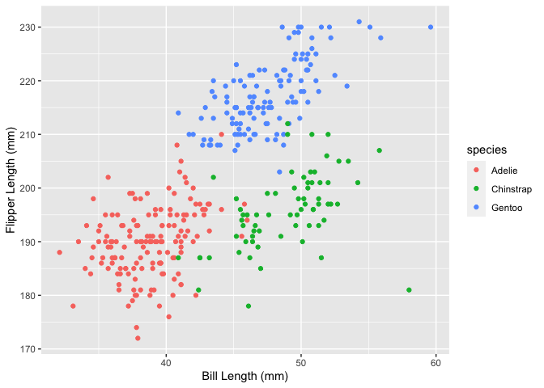

p8105\_hw1\_jl6049
================
LYU JING
9/23/2021

## Problem 1

**1. I am trying to create a dataframe as request.**

``` r
create_df = tibble(
  norm_samp = rnorm(10),
  logical_vec = norm_samp > 0,
  char_vec = c("a","b","c","d","e","f","g","h","i","j"),
  factor_vec = factor(c("small", "median","large","samll","median","large","samll","median","large", "samll"))
)
```

I have created a dataframe with a random sample, a logical vector, a
character vector and a factor vector.

**2. I am trying to take the mean of each variable in your dataframe.**

-   for the mean of random norm sample.

``` r
mean_norm = mean(pull(create_df, norm_samp))
```

—It works! It is 0.259432

-   For the mean of logical vector.

``` r
mean_log = mean(pull(create_df, logical_vec))
```

—It works! It is 0.6

-   For the mean of character vector.

``` r
mean_char = mean(pull(create_df, char_vec))
```

    ## Warning in mean.default(pull(create_df, char_vec)): argument is not numeric or
    ## logical: returning NA

—It does not work.

-   For the mean of factor vector.

``` r
mean_factor = mean(pull(create_df, factor_vec))
```

    ## Warning in mean.default(pull(create_df, factor_vec)): argument is not numeric or
    ## logical: returning NA

—It does not work.

**3. I am trying to use as.numeric function on the logical, character,
and factor variables to convert them to numeric.**

``` r
numeric_logical = as.numeric(pull(create_df, logical_vec))
numeric_char = as.numeric(pull(create_df, char_vec))
numeric_factor = as.numeric(pull(create_df, factor_vec))
```

Result: as.numeric function could change the logical and factor
variables into numbers, but it does not work on character vector. That
could because logical could be saved as “0” and “1” and factor could be
saved as ordinal numbers. But character cannot be saved by numbers.

However, when it comes to get the mean, things could be different for
factor variables. Because that the ordinal numbers cannot represent the
actual meaning of the factor levels, so that we cannot get the mean of a
factor by just calculate the relative number of the levels.

## Problem 2

**1. Input data “penguins”.**

``` r
data("penguins", package = "palmerpenguins")
```

**2. get more knowledge about the dataset.**

``` r
names(penguins)
skimr::skim(penguins)
nrow(penguins)
ncol(penguins)
mean_flipper = mean(pull(penguins, flipper_length_mm), na.rm = TRUE)
```

-   The dataset contains 8 variables including species, island,
    bill\_length\_mm, bill\_depth\_mm, flipper\_length\_mm,
    body\_mass\_g, sex, year
-   The values of variables could be observed as follows:

|                                                  |          |
|:-------------------------------------------------|:---------|
| Name                                             | penguins |
| Number of rows                                   | 344      |
| Number of columns                                | 8        |
| \_\_\_\_\_\_\_\_\_\_\_\_\_\_\_\_\_\_\_\_\_\_\_   |          |
| Column type frequency:                           |          |
| factor                                           | 3        |
| numeric                                          | 5        |
| \_\_\_\_\_\_\_\_\_\_\_\_\_\_\_\_\_\_\_\_\_\_\_\_ |          |
| Group variables                                  | None     |

Data summary

**Variable type: factor**

| skim\_variable | n\_missing | complete\_rate | ordered | n\_unique | top\_counts                 |
|:---------------|-----------:|---------------:|:--------|----------:|:----------------------------|
| species        |          0 |           1.00 | FALSE   |         3 | Ade: 152, Gen: 124, Chi: 68 |
| island         |          0 |           1.00 | FALSE   |         3 | Bis: 168, Dre: 124, Tor: 52 |
| sex            |         11 |           0.97 | FALSE   |         2 | mal: 168, fem: 165          |

**Variable type: numeric**

| skim\_variable      | n\_missing | complete\_rate |    mean |     sd |     p0 |     p25 |     p50 |    p75 |   p100 | hist  |
|:--------------------|-----------:|---------------:|--------:|-------:|-------:|--------:|--------:|-------:|-------:|:------|
| bill\_length\_mm    |          2 |           0.99 |   43.92 |   5.46 |   32.1 |   39.23 |   44.45 |   48.5 |   59.6 | ▃▇▇▆▁ |
| bill\_depth\_mm     |          2 |           0.99 |   17.15 |   1.97 |   13.1 |   15.60 |   17.30 |   18.7 |   21.5 | ▅▅▇▇▂ |
| flipper\_length\_mm |          2 |           0.99 |  200.92 |  14.06 |  172.0 |  190.00 |  197.00 |  213.0 |  231.0 | ▂▇▃▅▂ |
| body\_mass\_g       |          2 |           0.99 | 4201.75 | 801.95 | 2700.0 | 3550.00 | 4050.00 | 4750.0 | 6300.0 | ▃▇▆▃▂ |
| year                |          0 |           1.00 | 2008.03 |   0.82 | 2007.0 | 2007.00 | 2008.00 | 2009.0 | 2009.0 | ▇▁▇▁▇ |

-   The dataset has 344 rows and 8 columns
-   The mean flipper length is 200.9152047

**3. Make a scatterplot!**

``` r
ggplot(penguins, aes(x = bill_length_mm, y = flipper_length_mm, color = species)) + geom_point() + labs(x = "Bill Length (mm)" , y = "Flipper Length (mm)")
```

<!-- -->

**4. Export my scatterplot**

``` r
ggsave("scatterplot.png", height = 4, width = 6)
```
